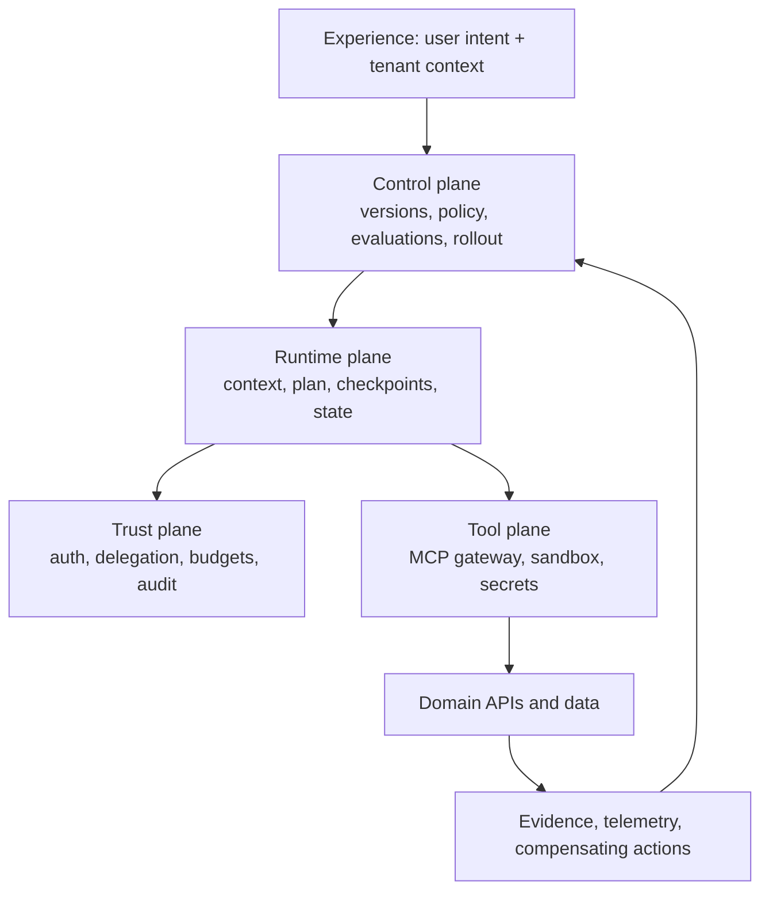

# Agentic Systems Architecture & Frameworks

> Put deterministic controls around probabilistic decisions so an agent can be useful without becoming ungovernable.

## TL;DR
- An agentic product is more than a model: it includes context, tools, state, policy, evaluation, UX, and operations.
- Persist goals, plans, approvals, actions, artifacts, and outcomes; prompts are not durable workflow state.
- Give agents bounded authority and make high-impact actions reversible, observable, and approved.
- Frameworks such as BMAD Method and Superpowers can structure delivery, but one workflow must own the implementation loop.

## Quickstart (Do this now)
1. Map one agent action from user intent to authorized, observable, reversible business outcome.
2. Define the agent's scope: data, tools, time, spend, action count, and approval requirements.
3. Persist run state and artifacts outside the prompt.
4. Start in suggest or draft mode, then promote autonomy only after evaluation evidence.
5. Choose one delivery framework for implementation and document how it coexists with repository instructions.

## The Idea (Slightly deeper)
The reliable shape is a **probabilistic core with a deterministic shell**. The model can select among actions that code and policy have already allowed. Schemas, authorization, budgets, deadlines, idempotency, audit trails, approval states, and kill switches sit outside the model.

Separate a control plane from a runtime plane. The control plane versions agents, prompts, policies, models, tools, evaluation status, and rollout cohorts. The runtime plane resolves the current user's authority, builds minimal authorized context, executes a bounded plan, checkpoints material steps, and records evidence.

## Deep Dive

### Architecture principles
- **Capability over model**: build the durable context, tools, policy, and evaluation around interchangeable providers.
- **Evidence before fluency**: attach sources, confidence, and artifact lineage to decisions.
- **Evaluation is architecture**: use offline golden cases, sandbox/shadow runs, canaries, online signals, and human review as release gates.
- **Reversibility by design**: prefer drafts, previews, compensating actions, and approval gates over direct irreversible writes.
- **Assume model churn**: version model, prompt, policy, and tool schema independently behind a capability contract.

### BMAD Method and Superpowers
**BMAD Method** is helpful for upstream phases—idea shaping, requirements, architecture, and stories—using specialized agents and right-sized tracks. **Superpowers** is a skill-based development methodology centered on disciplined workflows such as brainstorming, planning, test-driven development, debugging, and two-stage review. They can coexist, but both can try to own implementation. Choose one phase-four owner and state the precedence in `AGENTS.md` or equivalent repository guidance.

## Core Skills
- **Agent-run design**: explicit lifecycle, state machine, budgets, retry and compensation semantics.
- **Delegated authorization**: every tool call carries actor, tenant, purpose, scope, and expiry.
- **Evaluation engineering**: test task quality, safety, cost, recovery, and business effect before expanding autonomy.
- **Workflow-framework selection**: adopt the smallest framework that addresses the actual delivery bottleneck.

## When to Use This
- **Use when**: an AI system can act on behalf of a user, call tools, or affect durable business state.
- **Use when**: teams are moving from isolated agents to a platform with shared security and operations.
- **Do not use**: a complex multi-agent platform merely because a straightforward workflow or service will do.

## Common Pitfalls
- **Prompt as database**: persist lifecycle and approval state in durable storage.
- **Unlimited autonomy**: enforce time, spend, scope, and action ceilings in code.
- **Framework collision**: explicitly select which method owns each delivery phase.
- **Model lock-in**: separate capability contracts from model vendor details.

## Resources & Links
- **[BMAD Method documentation](https://docs.bmad-method.org/)** — specialized agents and guided AI development workflows.
- **[Superpowers](https://github.com/obra/superpowers)** — composable agent skills and a disciplined development methodology.
- **[Model Context Protocol](https://modelcontextprotocol.io/)** — interoperable tool connectivity; pair it with policy controls.
- **[NIST AI RMF Playbook](https://airc.nist.gov/AI_RMF_Knowledge_Base/Playbook)** — operational AI-risk actions and governance practices.

## Next Steps
- Apply the controls to tool integration with [Model Context Protocol](model-context-protocol.md).
- Design implementation roles in [Multi-Agent Coding Workflows](multi-agent-coding-workflows.md).
