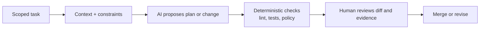

# AI Coding Foundations & Trust

> Use AI to accelerate engineering work without handing it unchecked authority.

## TL;DR
- AI coding tools range from autocomplete to agents that can edit files and run commands. Treat those as different risk levels.
- An LLM proposes text; an agent adds tools, memory, and the ability to act. Neither replaces an engineer's accountability.
- Start with small, reversible tasks and require tests, diffs, and human review before merging.

## Quickstart (Do this now)
1. Pick one low-risk task: add a unit test, explain a module, or scaffold a small endpoint.
2. Give the agent the goal, relevant files, constraints, and the command that proves success.
3. Ask for a plan before edits when the task spans more than one file.
4. Review the diff and run the tests yourself; do not merge on an agent's assertion alone.
5. Record the outcome: time saved, defects found, and where the agent needed correction.

## The Idea (Slightly deeper)
AI assistance is not one capability. **Suggestions** complete code in place; **assisted editing** lets the developer steer a multi-file change; **task execution** lets an agent plan, modify files, invoke tools, and report results. The further the tool can act, the more explicit its scope and verification need to be.

A useful trust model is: the agent may propose and execute *permitted* work, while people and deterministic controls decide what is permitted. Keep write permissions, budgets, secrets, protected branches, and production changes behind clear gates.

## Deep Dive

The right working loop is **brief → plan → change → prove → review**. For a tiny deterministic edit, the plan may be one sentence. For a security-sensitive or cross-service change, require an implementation plan, tests, a threat review, and an explicit approver. A clean diff, a passing test, and a stated limitation are stronger evidence than confident prose.

## Core Skills
- **Task scoping**: state the outcome, affected area, acceptance criteria, and non-goals.
- **Context selection**: expose only the files and decisions needed for the task.
- **Evidence-based review**: inspect diffs, tests, logs, and security implications.
- **Progressive autonomy**: promote an automation only after it repeatedly meets quality, safety, and cost thresholds.

## When to Use This
- **Use when**: you want a safe baseline for adopting Copilot, Codex, Claude Code, Cursor, or similar tools.
- **Use when**: defining team expectations for AI-created pull requests.
- **Do not use as a substitute for**: code ownership, review policy, access control, or incident response.

## Common Pitfalls
- **“It passed” without evidence**: require the exact command and result, then reproduce it when it matters.
- **Unbounded tool access**: use least privilege, sandboxes, and approval gates for side effects.
- **Starting with autonomous refactors**: begin with well-bounded tasks and grow the workflow deliberately.
- **Confusing speed with quality**: track rework and production outcomes, not only generated lines of code.

## Resources & Links
- **[GitHub Copilot task best practices](https://docs.github.com/en/copilot/using-github-copilot/using-copilot-coding-agent-to-work-on-tasks/best-practices-for-using-copilot-to-work-on-tasks)** — practical guidance on instructions, validation, and reviewable work.
- **[OWASP Top 10 for LLM Applications](https://owasp.org/www-project-top-10-for-large-language-model-applications/)** — a security lens for AI-assisted systems and tools.
- **[NIST AI Risk Management Framework](https://www.nist.gov/itl/ai-risk-management-framework)** — a governance framework for measuring and managing AI risk.

## Next Steps
- Build strong inputs with [Context, Model & Prompt](context-model-prompt.md).
- Make work auditable with [Specification-Driven Development](specification-driven-development.md).
- Automate checks safely with [AI PR Review Automation](ai-pr-review-automation.md).
