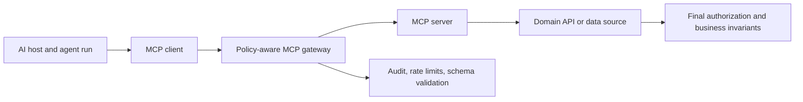

# Model Context Protocol (MCP)

> MCP standardizes the connection; your platform still owns authorization, safety, and auditability.

## TL;DR
- MCP is an open protocol for connecting AI applications to tools, data, and reusable prompts.
- Its basic topology is **host → client → server → external system**.
- MCP solves integration repeat work; it does not automatically solve permissions, tenant isolation, privacy, or safe side effects.

## Quickstart (Do this now)
1. Pick one read-only, low-risk use case—such as querying repository issues or reading approved documentation.
2. Write a tool contract: typed input/output, scope, sensitivity, timeout, retry safety, and cost.
3. Run the server with least-privilege credentials and a narrowly defined filesystem or API scope.
4. Put schema validation, authorization, logging, and rate limits at the gateway.
5. Add a domain-service authorization check before any write operation.

## The Idea (Slightly deeper)
Without a common protocol, every AI application must build an adapter for every tool or data source. MCP provides a common way for hosts to discover and invoke capabilities. Servers may expose resources, tools, and prompts; clients can supply controlled roots and sampling support where applicable.

MCP is an interoperability layer, not an identity system. The agent runtime must carry the user, tenant, purpose, and run scope. A policy-aware gateway should authorize each call at execution time, inject credentials rather than exposing them, capture audit events, and enforce budgets. The domain API must independently protect its invariants.

## Deep Dive

For every tool, declare whether it is read-only or has side effects; what resource scope it accepts; whether it handles sensitive data; and whether it is safe to retry. Use egress allowlists, sandboxing, short-lived credentials, output limits, and prompt-injection defenses. Prefer draft or preview operations to direct publication.

## Core Skills
- **Protocol literacy**: understand hosts, clients, servers, transports, and capability discovery.
- **Tool-contract design**: provide typed interfaces and explicit operational semantics.
- **Authorization propagation**: preserve who is acting, for whom, why, and within which limits.
- **Safe execution**: validate, meter, trace, redact, and revoke tool access.

## When to Use This
- **Use when**: connecting coding agents to GitHub, issue trackers, databases, knowledge bases, or internal tools.
- **Use when**: several AI clients should share the same domain capability.
- **Do not use**: MCP merely to wrap a latency-critical internal call that needs no AI-client interoperability.

## Common Pitfalls
- **Treating MCP as authorization**: enforce policy at the gateway and the domain API.
- **Overbroad servers**: expose a small, task-specific capability surface.
- **Hidden side effects**: classify writes, require confirmation, and design idempotency.
- **Untrusted tool output**: sanitize returned content before it is treated as instructions.

## Resources & Links
- **[Model Context Protocol documentation](https://modelcontextprotocol.io/)** — official specification and implementation guidance.
- **[MCP security best practices](https://modelcontextprotocol.io/specification/2025-06-18/basic/security_best_practices)** — protocol-specific security considerations.
- **[OWASP Agentic Security Initiative](https://genai.owasp.org/initiatives/agentic-security-initiative/)** — risks and mitigations for agentic systems.

## Next Steps
- Govern tools and runs through [Agentic Systems Architecture & Frameworks](agentic-systems-architecture.md).
- Automate review workflows using [AI PR Review Automation](ai-pr-review-automation.md).
