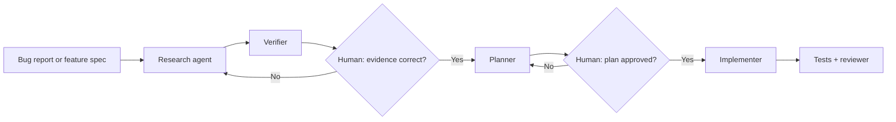

# Multi-Agent Coding Workflows

> Specialize agents by responsibility, then make every handoff visible and reviewable.

## TL;DR
- Use multiple agents only when they need distinct goals, context, tools, policies, or evaluation criteria.
- Assign one clear responsibility per agent and exchange file-based artifacts instead of copying long outputs through prompts.
- Put humans at critical decision points: root cause, plan approval, security, release, and irreversible actions.

## Quickstart (Do this now)
1. Choose one workflow, such as defect triage, and map its evidence and decision points.
2. Split it into narrow roles: researcher, verifier, planner, implementer, and reviewer.
3. Define a file artifact for every handoff, for example `research.md` or `implementation-plan.md`.
4. Add a human checkpoint before planning and before implementation.
5. Measure whether the workflow reduces cycle time *and* improves defect escape rate.

## The Idea (Slightly deeper)
Multi-agent systems are orchestration systems, not a way to multiply unverified guesses. A good workflow uses explicit state, bounded tool access, file-based artifacts, and sequential phase gates. The controller should coordinate, review evidence, and route work; it need not write every line of code.

The architect–editor pattern is a useful default: use a capable planner to investigate and design, then give a focused implementation agent an approved artifact. This protects expensive reasoning time and prevents implementation from silently redefining requirements.

## Deep Dive

Use a multi-agent pattern only when specialization earns its coordination cost. **Prompt chaining** fits linear work; **routing** sends tasks to a specialist; **parallelization** helps independent research; **orchestrator–workers** fits dynamic work allocation; **evaluator–optimizer** improves bounded artifacts through a feedback loop. For simple step decomposition, a normal workflow or function is usually clearer.

## Core Skills
- **Role design**: one responsibility, purpose-built context, and specific output for each agent.
- **Artifact handoffs**: durable files for research, decisions, plans, and test evidence.
- **Checkpoint design**: human approval where incorrect work would be costly or irreversible.
- **Workflow evaluation**: assess end-to-end outcome, not agent activity volume.

## When to Use This
- **Use when**: a task combines investigation, planning, implementation, and independent verification.
- **Use when**: specialist contexts or policies differ—such as security review versus documentation.
- **Do not use when**: one bounded edit can be completed and tested by a single agent or developer.

## Common Pitfalls
- **Too many agents**: coordination overhead can erase speed gains.
- **Role overlap**: define the artifact and decision rights for each role.
- **Prompt-pasted handoffs**: files are cheaper to reference and easier to audit.
- **No stopping rule**: enforce iteration, step, cost, and time limits.

## Resources & Links
- **[GitHub Copilot custom agents](https://docs.github.com/en/copilot/concepts/agents/cloud-agent/about-custom-agents)** — specialized agent profiles for recurring work.
- **[Claude Code subagents](https://code.claude.com/docs/en/sub-agents)** — isolated specialist subagents and context control.
- **[LangGraph multi-agent concepts](https://langchain-ai.github.io/langgraph/concepts/multi_agent/)** — orchestration patterns and trade-offs.

## Next Steps
- Connect agents safely through [Model Context Protocol](model-context-protocol.md).
- Bring the architecture controls together in [Agentic Systems Architecture & Frameworks](agentic-systems-architecture.md).
